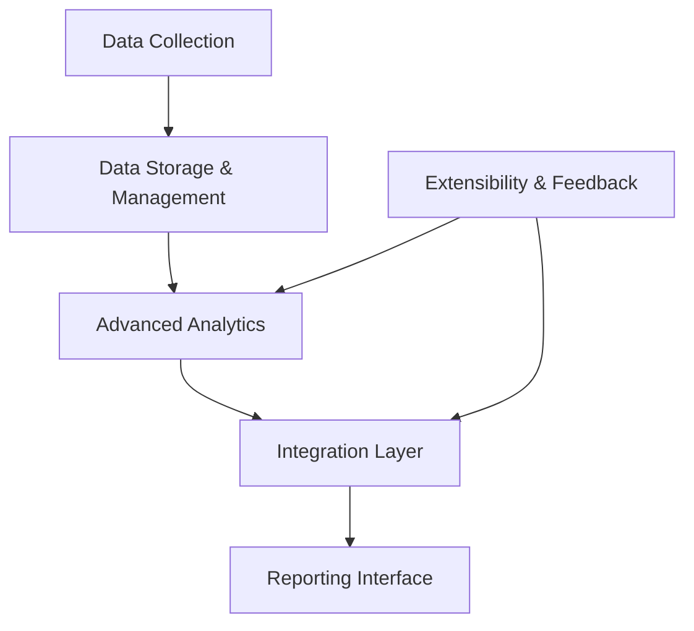

> **论文标题**：Advanced Persistent Threat Attack Detection Systems: A Review of Approaches, Challenges, and Trends  
> **作者**：Robin Buchta, George Gkoktsis, Felix Heine, Carsten Kleiner  
> **期刊**：Digital Threats: Research and Practice, Vol. 5, No. 4, 2024  
> **DOI**：[10.1145/3696014](https://doi.org/10.1145/3696014)

---

## 🔍 一、研究背景与目的

高级持续性威胁（APT）是一类高度复杂、隐蔽性强、目标明确的攻击，传统入侵检测系统难以有效识别。本文旨在：

- 对现有APT攻击检测方法进行系统分类与评估；
- 识别当前研究的不足与挑战；
- 提出一个参考系统架构；
- 探讨未来可能的研究方向与发展趋势。

---

## 📌 二、核心研究问题（RQs）

```text
RQ1: APT攻击检测具有什么独特性？
RQ2: 哪些检测系统或方法特别适用于APT检测？
RQ3: 当前APT检测系统使用哪些评估标准与数据集？
RQ4: 存在哪些研究空白和改进潜力？
```

---

## 🔥 三、APT攻击威胁模型（Threat Model）

### 3.1 攻击类型划分

APT攻击与常规网络攻击相比，具有更强的组织性、隐蔽性与目标明确性。论文基于DoD的六层威胁分级，将攻击类型分为：

| 攻击类型         | 描述 |
|------------------|------|
| **常规攻击**     | 快速实施、使用已知漏洞、无长期隐蔽行为（Tier I-II） |
| **多阶段攻击**   | 包含多个TTPs，如探测、横向移动、权限提升（Tier II-III） |
| **APT攻击**      | 高度组织化、目标明确、长期潜伏、资源充足（Tier IV-VI） |

### 3.2 APT攻击特性定义

- **Threat**：具备明确动机和资源的攻击者（国家、组织）；
- **Advanced**：能主动发现或植入新漏洞（如0day、供应链注入）；
- **Persistent**：持续性强，愿意长期潜伏、反复尝试；

### 3.3 APT与其他攻击的对比表

| 属性             | 常规攻击       | 多阶段攻击     | APT攻击                  |
|------------------|----------------|----------------|---------------------------|
| 攻击者           | 个人黑客       | 犯罪团伙       | 国家/组织支持的高级团队 |
| 目标             | 无特定目标     | 企业/行业系统   | 战略目标（政府/工业）   |
| 目的             | 财务、炫技     | 金钱、勒索      | 情报、破坏、长期渗透     |
| 攻击模式         | 快速、单步     | 多TTP组合       | 长期潜伏、“低慢”渗透    |
| 隐蔽性           | 弱             | 中             | 极强，常用“活在系统中”战术 |

---

## 🎯 四、APT攻击检测方法分类

### 4.1 检测类型（Detection Types）

- **Rule-based（基于规则）**：
  - 依赖专家定义的规则或已知特征（如Snort、YARA）；
  - 精确但易被规避，误报率高。

- **Anomaly-based（基于异常）**：
  - 建模正常行为，检测偏离行为；
  - 对未知攻击敏感，适合APT检测。

- **Statistical（统计学方法）**：
  - 使用统计分布、概率建模检测异常（如高斯、HMM）；
  - 在稀疏数据下表现不佳。

- **Classification（分类方法）**：
  - 使用机器学习模型对行为进行标记；
  - 依赖大量已标注数据。

- **Human Knowledge（人类知识）**：
  - 借助领域专家、CTI、IoC规则；
  - 可解释性强，但依赖人工更新。

### 4.2 学习方式（Learning Paradigms）

- **Supervised Learning（监督学习）**：
  - 输入为已标记的正常/异常样本；
  - 适合有历史攻击记录的场景。

- **Unsupervised Learning（无监督学习）**：
  - 无需标签，挖掘数据中的模式与离群点；
  - 适用于未知APT场景。

- **Semi-Supervised Learning（半监督学习）**：
  - 使用少量标记样本 + 大量未标记数据；
  - 提高模型泛化能力。

- **One-Class Learning（单类学习）**：
  - 仅学习“正常”行为，适合APT难以获取攻击样本的情况；
  - 与无监督学习相似但有轻度标签指导。

---

## 📊 五、评估体系与数据集

### 5.1 评估指标（Metrics）

| 指标名称               | 描述 |
|------------------------|------|
| **TPR / FPR**          | 检测率 / 误报率 |
| **Precision / Recall** | 精确率 / 召回率 |
| **F1 Score**           | 综合指标，平衡精准与召回 |
| **Granularity**        | 检测粒度（IoC、事件级、进程级、路径级） |
| **Correlatability**    | 多事件/多源数据的融合与回溯能力 |
| **Robustness**         | 对抗逃逸攻击的鲁棒性 |
| **Ease of Use**        | 易用性与集成能力（如与SIEM兼容） |

### 5.2 检测粒度（Granularity Levels）

- **IoC级别**：黑名单匹配，如IP、哈希；
- **事件级**：单个日志事件（登录、访问）；
- **进程/文件级**：行为背后的主体；
- **路径/图级**：多事件构成的攻击链；
- **系统级**：系统状态是否异常。

### 5.3 常用APT检测数据集

| 数据集       | 描述 |
|--------------|------|
| **DAPT2020** | 强调内网行为序列，设计APT渗透链完整 |
| **DARPA TC** | 多源图日志 + 测试用红队攻击；格式为CDM |
| **OpTC**     | 来自CHASES计划，涵盖1000台Windows主机行为数据 |
| **CERT**     | 合成内部威胁数据（邮件、日志、Web访问） |
| **LANL**     | 来自真实企业网络的多源日志，有攻击标签 |

---

## 🏗️ 六、APT攻击检测系统参考架构（Reference Architecture）

论文提出了首个用于APT检测的参考系统架构，以便为不同检测方法提供统一对比基础，支持系统间的可比性和扩展性。

### 6.1 架构设计原则

- **全面覆盖（Comprehensive Coverage）**：整合网络、主机、应用等多源异构数据；
- **高级分析（Advanced Analytics）**：支持图结构、长时间跨度的模式挖掘；
- **系统集成（Integration）**：可与现有SIEM、防火墙、IDS等对接；
- **持续监测（Continuous Monitoring）**：系统应提供持续行为收集能力；
- **自适应性（Adaptability）**：具备动态适应系统更新/反馈能力。

### 6.2 架构组成模块


#### ✅ 各模块功能简述

|模块名|描述|
|---|---|
|**Data Collection**|从系统/网络采集原始日志数据，可结合CamFlow、AuditD等|
|**Storage & Management**|统一格式存储，如图数据库、流处理平台，支持长期追踪|
|**Advanced Analytics**|支持图神经网络、异常检测、自监督模型等多种分析方法|
|**Integration Layer**|接入外部情报源、规则系统、SIEM平台等|
|**Reporting Interface**|呈现结果，包括告警、行为路径图、指标趋势等|
|**Extensibility & Feedback**|用户反馈机制、自适应训练（如reinforcement learning）|

---

## 🔍 七、APT检测系统对比分析（System Comparison）

该章节重点从70篇文献中筛选出**18个代表性APT检测系统**，并对其结构、数据类型、检测方式、学习模式等进行系统性对比。

### 7.1 系统对比维度

|维度|示例描述|
|---|---|
|**威胁建模等级**|Conventional / Multi-Step / APT|
|**数据类型**|Network / Host / Other / Graph|
|**检测类型**|Rule-based / Anomaly-based / Statistical / Classification / CTI|
|**学习方式**|Supervised / Unsupervised / One-Class / Semi-supervised|
|**是否使用图结构**|✅ / ❌|

### 7.2 典型系统分析表格

|系统名称|数据源|图结构|检测方式|学习方式|关键特征|
|---|---|---|---|---|---|
|**ThreaTrace**|主机日志|✅|异常检测|One-Class|GraphSAGE 多子模型、节点可追踪|
|**Kairos**|Provenance日志|✅|异常检测|自监督 + GRU|时序图神经网络，生成攻击图|
|**StreamSpot**|图日志流|✅|流式聚类|无监督|局部图哈希 + Cosine相似度|
|**NetWalk**|动态图|✅|聚类 + AE|无监督|Clique Embedding + 随机游走|
|**Log2Vec**|系统日志|✅|聚类|无监督|日志图嵌入 + Word2Vec|
|**Pikachu**|主机+网络|✅|边异常预测|One-Class|时间图快照 + GRU预测器|
|**Unicorn**|CamFlow|✅|HistoSketch|One-Class|WL-Graph Kernel压缩图摘要|
|**FRAPpuccino**|CamFlow|✅|滑窗聚类|One-Class|标签传播构建特征向量|
|**Pagoda**|Provenance日志|✅|规则匹配|规则学习|自动生成依赖路径规则集|
|**ProvDetector**|系统行为图|✅|图GNN检测|半监督|攻击路径识别 + 多层GNN|

### 7.3 综合发现与趋势总结

- **趋势一：图结构已成为APT检测的核心建模方式**
    - Provenance logs / 系统行为可自然建模为图；
    - 多个系统使用 GNN（GraphSAGE, UniMP, TGN 等）对图进行学习与检测。
- **趋势二：One-Class学习在APT场景下表现优越**
    - 训练集通常无法涵盖足够攻击样本；
    - 学习“正常”行为后检测偏离，误报率低。
- **趋势三：系统应支持可解释性与可追溯性**
    - 检测“是否攻击”不够，更需要溯源“攻击路径”；
    - Kairos、ThreaTrace 提供图级别输出，支持后续溯源与取证。
- **趋势四：现有系统在评估指标上不统一**
    - 多数方法无法横向对比；
    - 呼吁标准化检测粒度、数据集与指标体系。

---

## 🧠 八、研究讨论（Discussion）

本文通过全面回顾APT攻击检测系统，从理论模型、检测方法、数据结构到评估指标等多个维度进行了系统性分类与总结，得出了如下关键性讨论点：

### 8.1 APT检测的复杂性本质

- APT攻击**具有低频、高危、长期潜伏性**，本质上难以通过单点或单事件方式检测；
- APT往往**结合传统攻击战术（如SQL注入、社工）与高级手段（如0day、文件无痕）**，导致检测系统需要有极高的泛化能力与关联分析能力。

### 8.2 当前系统的不足之处

- 多数系统**检测粒度不够细**（如只报“异常事件”而非攻击路径）；
- **可解释性弱**：部分基于深度学习的系统如黑盒操作，难以被运维团队接纳；
- **数据集泛化能力差**：测试多集中于DAPT2020或DARPA-TC，缺乏跨平台跨组织通用性验证；
- **缺乏自适应反馈机制**，无法动态更新模型以适应系统变更、人员行为变化等。

### 8.3 图结构与One-Class结合具有前景

- 图结构具有良好的行为链建模能力；
- One-Class Learning 能够解决“无法获取APT攻击样本”的根本难题；
- 这类结合模型正逐步从学术走向工程应用，如 ThreaTrace 和 Kairos 提供了初步工程实现。

---

## 🔭 九、未来研究方向（Future Directions）

作者结合综述成果与当前研究空白，提出以下几个未来可能的研究重点方向：

### 9.1 标准化评估体系的构建

- 构建统一的数据集评估平台（如类似 ImageNet for APT）；
- 明确检测指标（FPR, TPR, Granularity 等）和评测流程，提升系统间对比的公平性和复现性。

### 9.2 可解释图神经网络的设计

- 引入可解释性模块，如节点影响评分、路径重要性可视化等；
- 将“图级检测”结果回映射为系统日志事件、进程链等可解读形式。

### 9.3 自适应学习机制引入

- 利用反馈优化机制（如RL, Online Learning）不断优化检测模型；
- 适应系统正常行为的演变（如版本升级、用户权限调整）。

### 9.4 与安全生态系统集成

- 支持与SIEM、SOAR、EDR系统集成，实现端到端告警联动；
- 提供标准化API和格式（如STIX、TAXII）以适配企业安全运营需求。

### 9.5 从检测走向联动响应

- 探索从APT检测到响应自动化（如Graph-based策略生成）；
- 未来可能形成“检测—评估—防御”三位一体的闭环。

---

## 📌 十、结语（Conclusion）

APT攻击检测是一项挑战重重但极具意义的研究任务。本文综述为该领域提供了：

- 系统性的文献归类与方法总结；
- 首个通用APT检测参考架构；
- 对图神经网络、One-Class学习等未来关键技术的展望。

未来的APT检测系统需要同时满足**准确性、实时性、解释性与自适应性**，并逐步从学术走向**工程应用与产业部署**。

---

