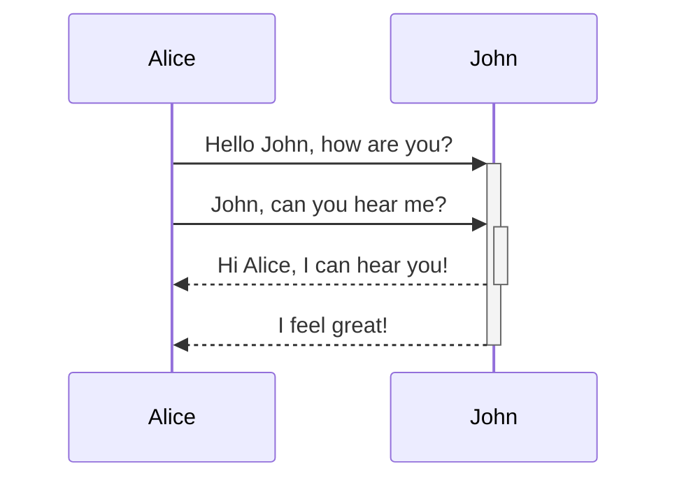
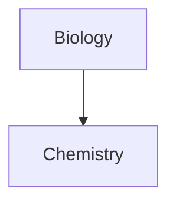

## 表格 
***

可以使用竖线 ( `|`) 分隔列并使用连字符 ( `-`) 定义标题来创建表格。以下是示例：

```md
| First name | Last name |
| ---------- | --------- |
| Max        | Planck    |
| Marie      | Curie     |
```

| 名    | 姓   |
| ---- | --- |
| 最大限度 | 普朗克 |
| 玛丽   | 居里  |

虽然表格两侧的垂直条是可选的，但为了便于阅读，建议将其包括在内。

_在实时预览中 ，您可以右键单击表格以添加或删除列和行。您还可以使用上下文菜单对它们进行排序和移动。

可以使用命令面板中的**插入表格** 命令来插入表格 ，或者右键单击并选择 _插入 → 表格_。这将为您提供一个基本的可编辑表格：

```md
|     |     |
| --- | --- |
|     |     |
```

请注意，单元格不需要完全对齐，但标题行必须至少包含两个连字符：

```md
First name | Last name
-- | --
Max | Planck
Marie | Curie
```

### 格式化表格中的内容 

可以使用[基本格式语法](基本格式化语法.md)来设置表格内容的样式。
```
| 第一列  | 第二列                                                                                                            |
| ---- | -------------------------------------------------------------------------------------------------------------- |
| 内部链接 | 链接到您的**保管**_库内的_文件。                                                                                            |
| 嵌入文件 |  |
```

| 第一列  | 第二列                                                                                                            |
| ---- | -------------------------------------------------------------------------------------------------------------- |
| 内部链接 | 链接到您的**保管**_库内的_文件。                                                                                            |
| 嵌入文件 |  |

通过在标题行中添加冒号 ( `:`) 来对齐列中的文本。

```md
| 左对齐文本 | 居中对齐文本 | 右对齐文本 |
| :---- | :----: | ----: |
| 内容    |   内容   |    内容 |
```

| 左对齐文本 | 居中对齐文本 | 右对齐文本 |
| :---- | :----: | ----: |
| 内容    |   内容   |    内容 |

## 图表 
***

可以使用Mermaid向您的笔记添加图表。Mermaid 支持一系列图表，例如[流程图](https://mermaid.js.org/syntax/flowchart.html)、[序列图](https://mermaid.js.org/syntax/sequenceDiagram.html)和[时间线](https://mermaid.js.org/syntax/timeline.html)。
还可以尝试使用 Mermaid 的[实时编辑器](https://mermaid-js.github.io/mermaid-live-editor)来帮助您在将图表包含在笔记中之前构建图表。
要添加美人鱼图，创建一个`mermaid` 代码块。

````md

````


````md

````


### 在图表中链接文件 

可以通过将类附加到节点来在图表中创建内部链接。`internal-link

````md

````


图表的内部链接不会显示在图形视图中。

如果的图表中有许多节点，则可以使用以下代码片段。

````md

````


这样，每个字母节点就成为一个内部链接，以节点文本作为链接文本。

如果在注释名称中使用特殊字符，则需要将注释名称放在双引号中。

```
class "⨳ special character" internal-link
```

或者，`A["⨳ special character"]`。


## 数学 
***

可以使用[MathJax](http://docs.mathjax.org/en/latest/basic/mathjax.html)和 LaTeX 符号在笔记中添加数学表达式。

要将 `MathJax` 表达式添加到您的笔记中，请将其括在双美元符号 (`$$`) 中。

```md
$$
\begin{vmatrix}a & b\\
c & d
\end{vmatrix}=ad-bc
$$
```

$$
\begin{vmatrix}a & b\\
c & d
\end{vmatrix}=ad-bc
$$

还可以通过将其包装在`$`符号中来内联数学表达式。

```md
This is an inline math expression $e^{2i\pi} = 1$.
```

这是一个内联数学表达式。$e^{2i\pi} = 1$.


## 支持的 Markdown 扩展 
